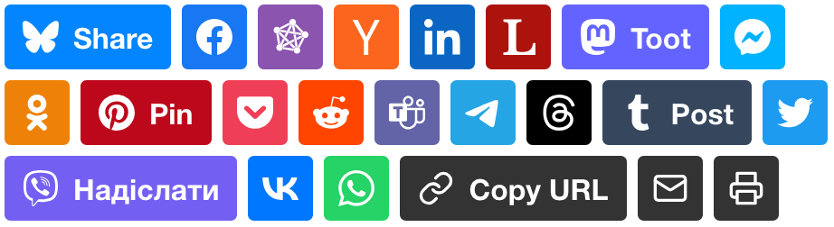

# Shareon


> Lightweight, stylish, and ethical share buttons

- **Small.** Dependency-free. CSS+JS bundle is only 6 KB minified and gzipped.
- **Stylish.** Uses official vector logos and colours with no visual mess.
- **Ethical.** Embeds no tracking code. JS is required only for the setup.

<a href="https://shareon.js.org/"></a>

See the live demo at [shareon.js.org](https://shareon.js.org)

## Install

Simply load the needed files from the CDN:

```html
<link
  href="https://cdn.jsdelivr.net/npm/shareon@2/dist/shareon.min.css"
  rel="stylesheet"
/>
<script
  src="https://cdn.jsdelivr.net/npm/shareon@2/dist/shareon.iife.js"
  defer
  init
></script>
```

- `defer` makes sure Shareon is loaded after HTML is parsed
- `init` will automatically initialize Shareon buttons

### Do not auto-initialize

Remove the `init` attribute and initialize Shareon when you need it:

```html
<script
  src="https://cdn.jsdelivr.net/npm/shareon@2/dist/shareon.iife.js"
  defer
></script>

<script>
  // do something
  Shareon.init();
</script>
```

### Use ESM build

There is also a ESM build for the browsers, which doesn't support
auto-initialization:

```html
<script type="module">
  import { init } from "https://cdn.jsdelivr.net/npm/shareon@2/dist/shareon.es.js";
  // do something
  init();
</script>
```

### Bundle with Node

You can also install Shareon using your favourite package manager and include it
in your source files:

```sh
pnpm add shareon  # or `npm install`, or `yarn add`
```

```js
import { init } from "shareon";
import "shareon/css"; // most bundlers will transpile this CSS

init();
```

CommonJS imports are also supported:

```js
const Shareon = require("shareon");
require("shareon/css"); // most bundlers will transpile this CSS

Shareon.init();
```

## Usage

Create a container with class `shareon` and populate it with elements, class
names of which match the names of the social networks (or `copy-url`, for the
'Copy URL' button:

```html
<div class="shareon">
  <a class="facebook"></a>
  <a class="linkedin"></a>
  <a class="mastodon"></a>
  <!-- FB App ID is required for the Messenger button to function -->
  <a class="messenger" data-fb-app-id="0123456789012345"></a>
  <a class="odnoklassniki"></a>
  <a class="pinterest"></a>
  <a class="pocket"></a>
  <a class="reddit"></a>
  <a class="telegram"></a>
  <a class="twitter"></a>
  <a class="viber"></a>
  <a class="vkontakte"></a>
  <a class="whatsapp"></a>
  <a class="copy-url"></a>
</div>
```

Shareon will populate these `<a>` elements with correct `href` attributes.

### Use with `<button>`s

You can use `<button>` (or any other element) instead of `<a>`s. In this case,
Shareon will create an `onclick`-listener for each button. **I do not recommend
doing this**, as this is not so good for semantics.

### Share metadata

By default, the URL and the title of the active page will be shared. You can
customize it with `data-` attributes. These can be applied on a specific button
or on the whole `.shareon` container:

```html
<div class="shareon" data-url="https://custom.url/for-this-page">
  <a class="facebook" data-title="Custom Facebook title"></a>
  <a class="twitter" data-title="Custom Twitter title"></a>
</div>
```

Apart from the URL and title, some networks support extra parameters:

- you **MUST** add `data-fb-app-id` to the FB Messenger button to make sharing
  even possible
- add `data-media` to an Odnoklassniki, Pinterest, or VK button to customize
  the pinned picture
- add `data-text` to a WhatsApp, Mastodon, Telegram, or Viber button to add
  custom message text
- add `data-via` to a Twitter or Mastodon button to mention a user

Here are all custom parameters:

```html
<div class="shareon" data-url="https://custom.url/for-this-page">
  <a class="facebook" data-title="Custom Facebook title"></a>
  <a class="messenger" data-fb-app-id="0123456789012345"></a>
  <a class="pinterest" data-media="https://custom.picture/for-pinterest">Pin</a>
  <a class="telegram" data-text="Check this out!"></a>
  <a class="twitter" data-via="MyNickname"></a>
  <a class="mastodon" data-via="@MyNickname@myserver.social"></a>
  <a class="whatsapp" data-url="https://custom.url/for-whatsapp">Send</a>
</div>
```

## Other versions

- [**WordPress plugin**](https://wordpress.org/plugins/shareon/) by [Gareth](https://github.com/gareth-gillman)

## Licence

Copyright © 2020–2022 [Nikita Karamov](https://www.kytta.dev/)  
Licenced under the [MIT License](https://spdx.org/licenses/MIT.html).

Shareon was heavily inspired by [Likely](https://ilyabirman.net/likely/),
and has a somewhat backwards-compatible API (excluding themes and sizes).
Likely is licenced under the MIT License.

Shareon's logo is the
[Postal Horn emoji](https://github.com/googlefonts/noto-emoji/blob/43f47be9404018cd9d8f73a227363a8f20acdab5/svg/emoji_u1f4ef.svg)
from [Noto Emoji](https://github.com/googlefonts/noto-emoji).
Noto Emoji is licenced under the
[Apache License v2.0](https://github.com/googlefonts/noto-emoji/blob/43f47be9404018cd9d8f73a227363a8f20acdab5/LICENSE).

Share icons are being sourced from [Simple Icons](https://github.com/simple-icons/simple-icons/).
Simple Icons is released under [CC0](https://spdx.org/licenses/CC0-1.0.html),
but the icons themselves may be subject to copyright of the respective owners.

---

This project is hosted on GitHub: <https://github.com/kytta/shareon>
